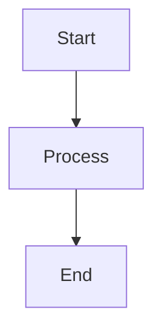

# Demo Markdown File

## Headings

# Heading 1
## Heading 2
### Heading 3

---

## Text Formatting

**Bold Text**

*Italic Text*

~~Strikethrough~~

`Inline Code`

---

## Lists

### Unordered List
- Apple
- Banana
- Mango

### Ordered List
1. First
2. Second
3. Third

---

## Task List

- [x] Completed Task
- [ ] Pending Task

---

## Blockquote

> This is a blockquote example.

---

## Code Blocks

### JavaScript

```js
function greet() {
  console.log("Hello World");
}
greet();
```

### Python

```python
def hello():
    print("Hello Engineering")
```

---

## Table

| Subject | Difficulty | Credits |
|----------|------------|---------|
| DSA | High | 4 |
| DBMS | Medium | 3 |
| OS | High | 4 |

---

## Links

[OpenAI](https://openai.com)

---

## Images


---

## Horizontal Line

---

## Nested Lists

- Mathematics
  - Calculus
    - Limits
    - Integration

---

## HTML Support

<div style="padding:10px;border:1px solid gray;">
  HTML inside Markdown
</div>

---

## Mathematical Expression

Inline equation:

$E = mc^2$

Block equation:

$$
a^2 + b^2 = c^2
$$

---

## Mermaid Diagram



---

## Quote + Code

> "Programs must be written for people to read."

```cpp
#include<iostream>
using namespace std;

int main() {
    cout << "Hello";
}
```

---

# End of Demo File